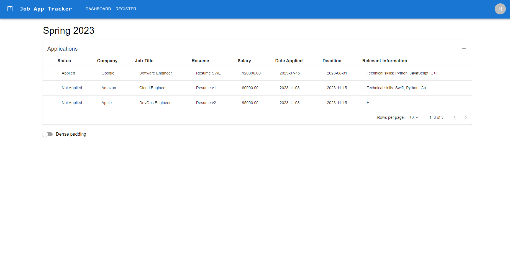
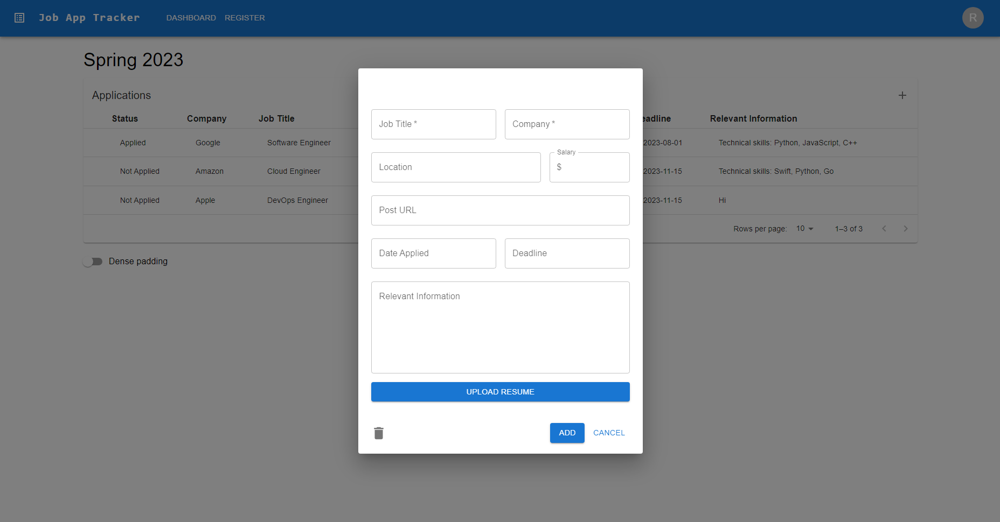
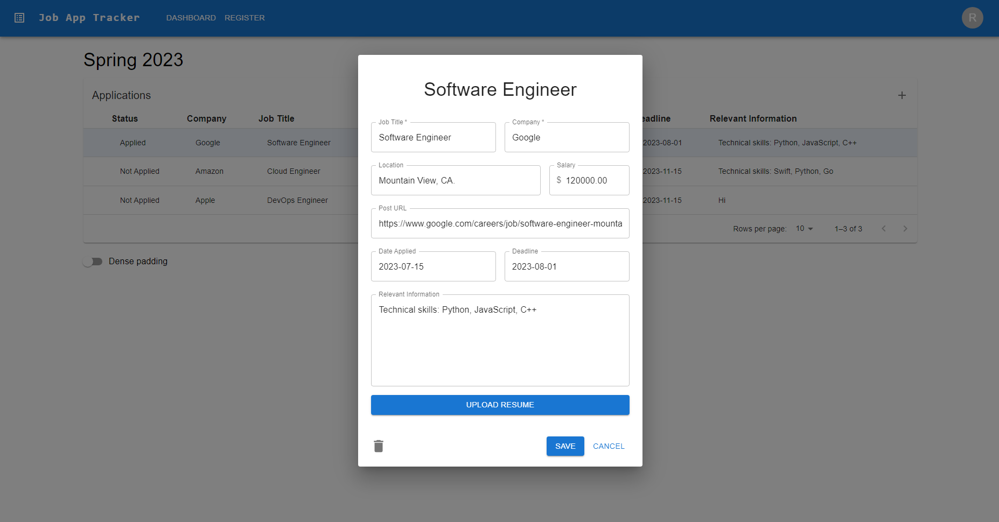

# Job Application Tracker

Job Application Tracker to keep track of and manage all your job applications: sort, create, edit, delete, group, etc.

UI developed using React, Typescript, and MaterialUI
 
Backend developed using Python, Django (Rest Framework), and PostgreSQL

 
 

